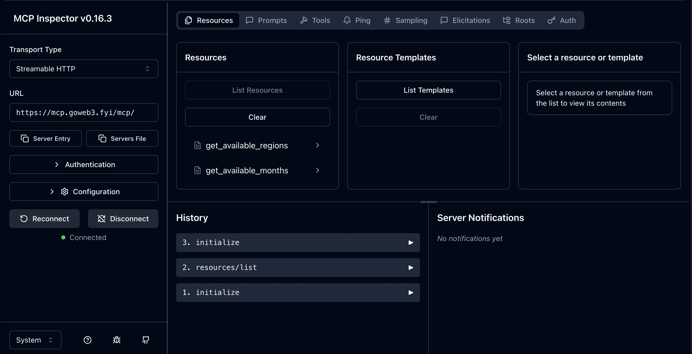

# Web3 Information MCP Server

## Introduction

This is a Model Context Protocol (MCP) server that provides access to the Web3 events and news from [GoWeb3.fyi](https://goweb3.fyi).

It allows MCP-enabled AI assistants, other applications to retrieve most important information directly via the MCP interface.

## Available Tools
The GoWeb3.fyi MCP server provides the following tools:
-  **search_events_by_region**: Searches for events in the database based on a provided region.
- **search_events_by_month**: Searches for events in the database based on a provided month.

## Available Resources
The GoWeb3.fyi MCP server provides the following resources:
- **get_available_regions**: Lists valid regions to be used in the search-by-region tool.
- **get_available_months**: Lists valid month to be used in the search-by-month tool.

## Setup

The MCP server could be directly accessed by connecting a mcp-enabled AI assistant or other application to [GoWeb3 MCP Server](https://mcp.goweb3.fyi/mcp) at https://mcp.goweb3.fyi/mcp.

For example, the MCP Inspector setup is shown in the picture below:

To access the server locally one could run a local-to-remote MCP server bridge - the python example is provided in [web3_mcp_local_server.py](web3_mcp_local_server.py).
